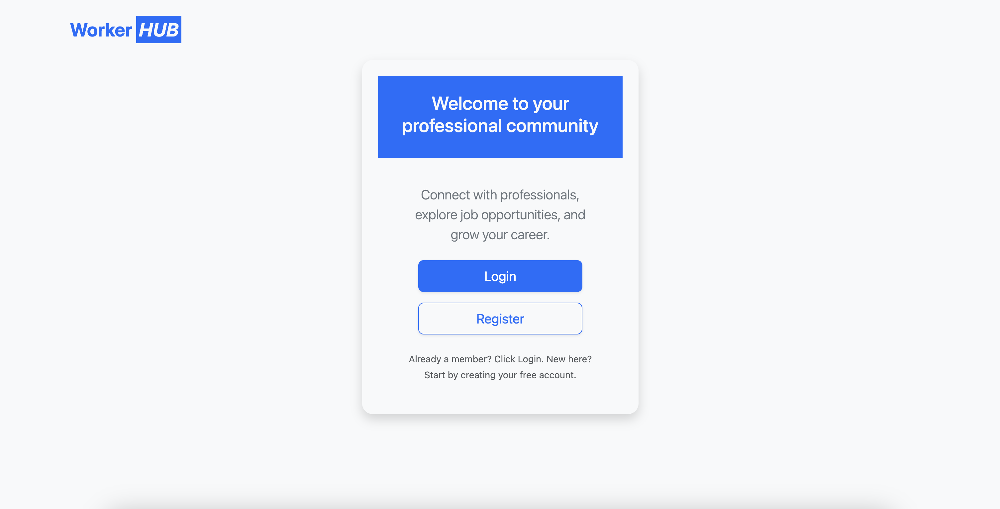

# WorkerHub - LinkedIn-like Application

**WorkerHub** is a platform designed for professional networking and job hunting, built using Django. The app features two primary roles: **Job Seekers** and **Employers**. The platform allows job seekers to manage their profiles, search for job opportunities, and connect with employers, while employers can post job listings and interact with potential candidates.

## Table of Contents

1. [Introduction](#introduction)
2. [Features](#features)
3. [Apps Overview](#apps-overview)
4. [Installation](#installation)
5. [Usage](#usage)
6. [Folder Structure](#folder-structure)
7. [Contributing](#contributing)
8. [License](#license)
9. [Contact](#contact)

## Introduction

**WorkerHub** is a dynamic application built to bridge the gap between job seekers and employers. It offers a networking platform with separate user roles, each having specific functionalities:
- **Job Seekers**: Can create and manage profiles, search for jobs, send and receive connection requests, post professional activities, and interact with posts.
- **Employers**: Can post job listings, view job seekers’ profiles, and interact with potential candidates.

The app is structured with four main Django applications: **Accounts**, **Core**, **Job Seekers**, and **Employers**.

## Features

- **Accounts App**:
  - User registration and authentication
  - Email verification for Account activation
  - Secure login/logout functionality
  - Password reset and update features
  - Role-based access control for Job Seekers and Employers

- **Core App**:
  - Handles general configurations and utilities across the project

- **Job Seekers App**:
  - Create and manage job seeker profiles
  - Search for job seekers and employers based on name or industry
  - Send and manage connection requests
  - Post activities and interact with posts (like, comment, share)

- **Employers App**:
  - Create and manage employer profiles
  - Post job listings
  - View and interact with job seeker profiles

## Apps Overview


- **WelCome Page**: 
  
  

### **Accounts App**
- Handles user authentication (registration, login, password reset).
- Manages user roles (Job Seekers and Employers).
- 

### **Core App**
- Provides utility functions used across the project, such as base templates, middleware, etc.

### **Job Seekers App**
- Allows job seekers to manage their profiles, search other users, and interact with posts.

### **Employers App**
- Lets employers create company profiles, post jobs, and connect with job seekers.

## Installation

To set up **WorkerHub** locally, follow these steps:

### Prerequisites
Make sure you have the following installed:
- Python 3.x
- Django 3.x or higher
- PostgreSQL (or any other database of your choice)
- Pip

### Steps

1. Clone the repository:

    ```bash
    git clone https://github.com/yourusername/WorkerHub.git
    cd WorkerHub
    ```

2. Create a virtual environment:

    ```bash
    python3 -m venv venv
    source venv/bin/activate  # On Windows use `venv\Scripts\activate`
    ```

3. Install required dependencies:

    ```bash
    pip install -r requirements.txt
    ```

4. Set up the database (PostgreSQL or another):
    - Update database configurations in `settings.py` (under `DATABASES`).
    - Run migrations:

    ```bash
    python manage.py migrate
    ```

5. Create a superuser:

    ```bash
    python manage.py createsuperuser
    ```

6. Run the application:

    ```bash
    python manage.py runserver
    ```

The app should now be accessible at `http://localhost:8000`.

## Usage

- Visit the login page at `/accounts/login/` to log in or register an account.
- Job Seekers can create profiles, search for jobs, and interact with posts and other users.
- Employers can post job listings and interact with job seekers.
- Both users can send and receive connection requests and engage with others' posts.

## Folder Structure

Here’s an overview of the project structure:

